See full Reference and Usage Guide at:
https://soul-traveller.github.io/github-traffic-dashboard/

# 📊 GitHub Traffic Dashboard

This dashboard tracks historical traffic data (clones and views) for GitHub repositories.

**Last Updated:** 2026-04-22T04:39:07.712716Z

## 📋 Table of Contents

Quick navigation to repository statistics:

- [Argyll_Printer_Profiler](#argyll-printer-profiler)
- [Argyll_Printer_Profiler_GUI](#argyll-printer-profiler-gui)
- [Toggle_Display_Profile](#toggle-display-profile)
- [average_ti3s_rgbgeom](#average-ti3s-rgbgeom)
- [github-traffic-dashboard](#github-traffic-dashboard)
- [read_image_patch_colors](#read-image-patch-colors)
- [rectarg](#rectarg)

# read_image_patch_colors

### 🗅️ Clones

*Repository clone statistics showing total and unique clones over different time periods.*

| Period | Total | Unique |
|--------|-------|--------|
| Last 30 Days | 23 | 23 |
| Last 90 Days | 23 | 23 |
| Lifetime | 23 | 23 |

### 📄 Repeat vs New Clones

*Analysis of repository adoption showing repeat clones vs new unique clones.*

*Note: GitHub API does not provide geographical location data for cloners.*

| Period | Total Clones | Unique Clones | Repeat Clones | Repeat % |
|--------|--------------|----------------|----------------|----------|
| Last 30 Days | 23 | 23 | 0 | 0.0% |
| Last 90 Days | 23 | 23 | 0 | 0.0% |
| Lifetime | 23 | 23 | 0 | 0.0% |

### 👀 Views

*Repository view statistics showing total and unique views over different time periods.*

| Period | Total | Unique |
|--------|-------|--------|
| Last 30 Days | 1 | 1 |
| Last 90 Days | 1 | 1 |
| Lifetime | 1 | 1 |

### 📞 Referrers

*Top referrer sources driving traffic to this repository.*

**Total Unique Referrers:** 1

| Referrer | Total Views | Unique Visitors |
|----------|-------------|----------------|
| github.com | 1 | 1 |

### 👥 Repeat vs New Visitors

*Analysis of visitor engagement showing repeat visitors vs new unique visitors.*

*Note: GitHub API does not provide geographical location data for visitors.*

| Period | Total Views | Unique Visitors | Repeat Visitors | Repeat % |
|--------|-------------|-----------------|-----------------|----------|
| Last 30 Days | 1 | 1 | 0 | 0.0% |
| Last 90 Days | 1 | 1 | 0 | 0.0% |
| Lifetime | 1 | 1 | 0 | 0.0% |

### 📈 Traffic Graphs

*Visual representations of traffic trends over different time periods.*

#### Daily Traffic (30 Days)

*Shows daily clones and views trends for the last 30 days. Useful for identifying short-term patterns and recent activity spikes.*

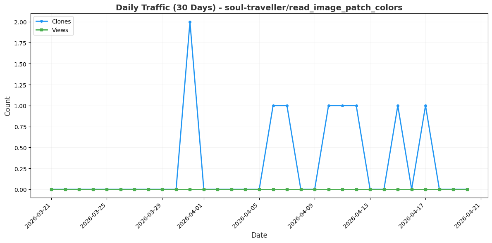

#### Weekly Traffic (12 Weeks)

*Shows weekly aggregated clones and views for the last 12 weeks (~3 months). Useful for identifying medium-term trends and seasonal patterns.*

#### Bi-Weekly Traffic (26 Periods)

*Shows bi-weekly aggregated clones and views for the last 26 periods (~1 year). Useful for identifying long-term trends and yearly patterns.*

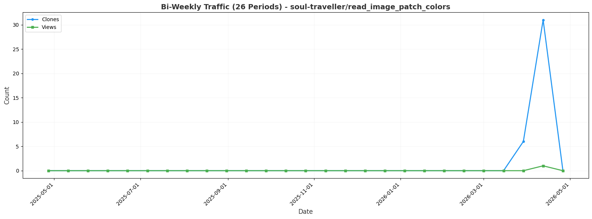

#### Cumulative Traffic (Lifetime)

*Shows running totals of both clones and views over the entire lifetime of tracking. Useful for seeing overall growth and total adoption.*

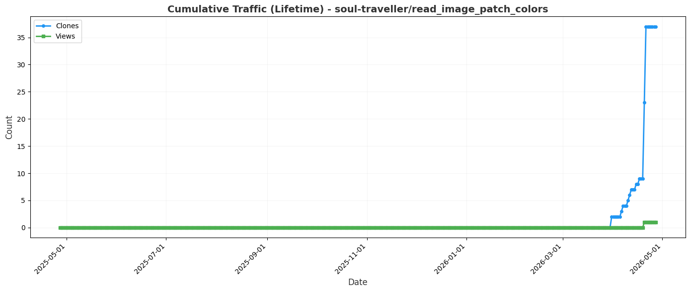

#### Separate Cumulative Graphs

*Individual cumulative graphs for clones and views, allowing for easier comparison between the two metrics.*

**Cumulative Clones:**

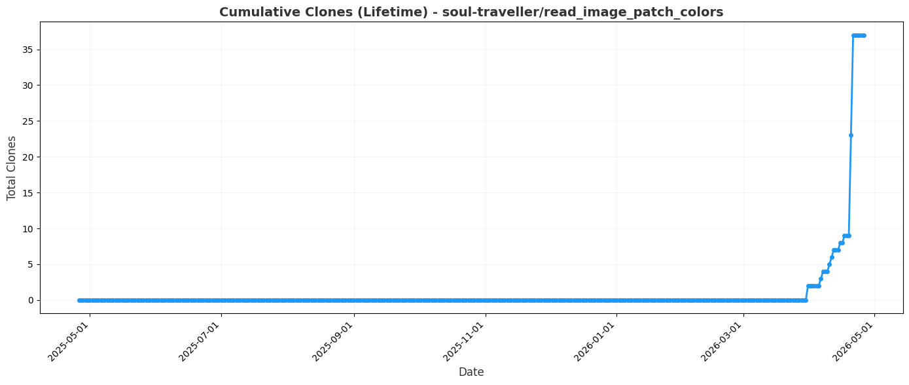

**Cumulative Views:**

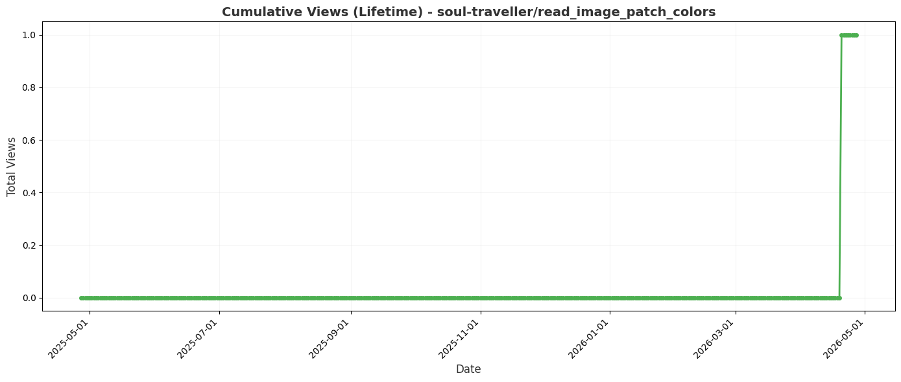

---

# Toggle_Display_Profile

### 🗅️ Clones

*Repository clone statistics showing total and unique clones over different time periods.*

| Period | Total | Unique |
|--------|-------|--------|
| Last 30 Days | 103 | 61 |
| Last 90 Days | 103 | 61 |
| Lifetime | 103 | 61 |

### 📄 Repeat vs New Clones

*Analysis of repository adoption showing repeat clones vs new unique clones.*

*Note: GitHub API does not provide geographical location data for cloners.*

| Period | Total Clones | Unique Clones | Repeat Clones | Repeat % |
|--------|--------------|----------------|----------------|----------|
| Last 30 Days | 103 | 61 | 42 | 40.8% |
| Last 90 Days | 103 | 61 | 42 | 40.8% |
| Lifetime | 103 | 61 | 42 | 40.8% |

### 👀 Views

*Repository view statistics showing total and unique views over different time periods.*

| Period | Total | Unique |
|--------|-------|--------|
| Last 30 Days | 84 | 8 |
| Last 90 Days | 84 | 8 |
| Lifetime | 84 | 8 |

### 📞 Referrers

*Top referrer sources driving traffic to this repository.*

**Total Unique Referrers:** 2

| Referrer | Total Views | Unique Visitors |
|----------|-------------|----------------|
| github.com | 11 | 1 |
| soul-traveller.github.io | 8 | 1 |

### 👥 Repeat vs New Visitors

*Analysis of visitor engagement showing repeat visitors vs new unique visitors.*

*Note: GitHub API does not provide geographical location data for visitors.*

| Period | Total Views | Unique Visitors | Repeat Visitors | Repeat % |
|--------|-------------|-----------------|-----------------|----------|
| Last 30 Days | 84 | 8 | 76 | 90.5% |
| Last 90 Days | 84 | 8 | 76 | 90.5% |
| Lifetime | 84 | 8 | 76 | 90.5% |

### 📈 Traffic Graphs

*Visual representations of traffic trends over different time periods.*

#### Daily Traffic (30 Days)

*Shows daily clones and views trends for the last 30 days. Useful for identifying short-term patterns and recent activity spikes.*

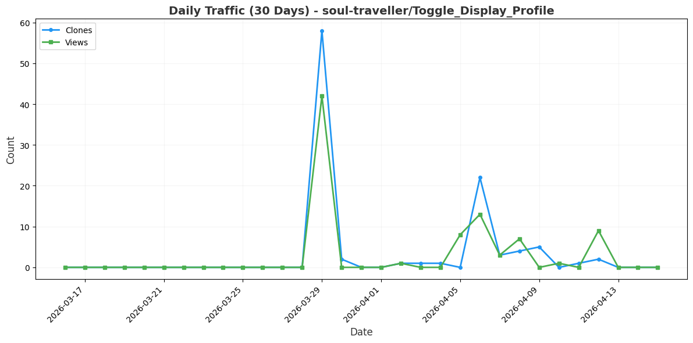

#### Weekly Traffic (12 Weeks)

*Shows weekly aggregated clones and views for the last 12 weeks (~3 months). Useful for identifying medium-term trends and seasonal patterns.*

#### Bi-Weekly Traffic (26 Periods)

*Shows bi-weekly aggregated clones and views for the last 26 periods (~1 year). Useful for identifying long-term trends and yearly patterns.*

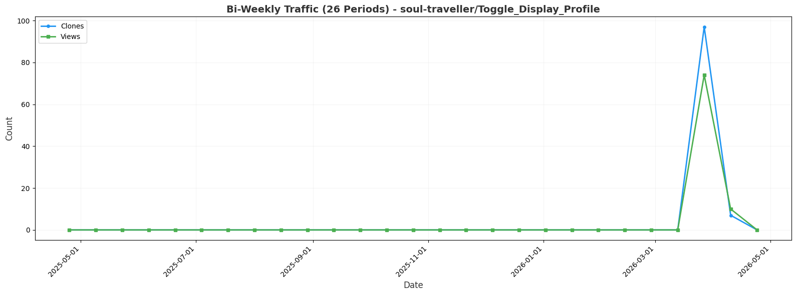

#### Cumulative Traffic (Lifetime)

*Shows running totals of both clones and views over the entire lifetime of tracking. Useful for seeing overall growth and total adoption.*

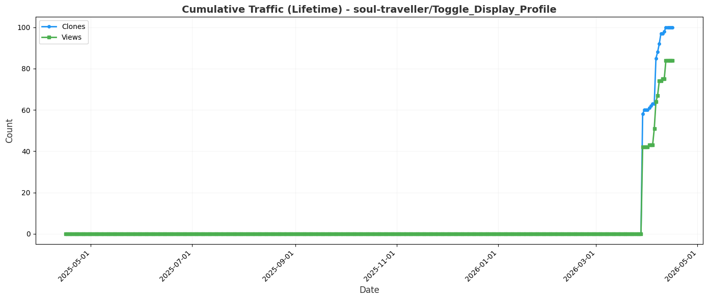

#### Separate Cumulative Graphs

*Individual cumulative graphs for clones and views, allowing for easier comparison between the two metrics.*

**Cumulative Clones:**

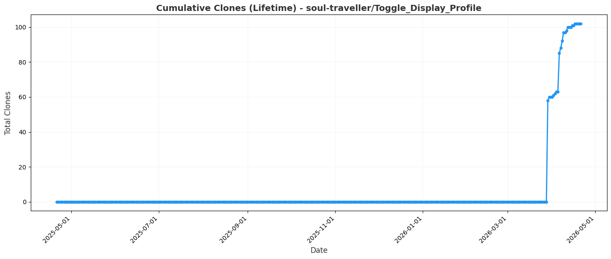

**Cumulative Views:**

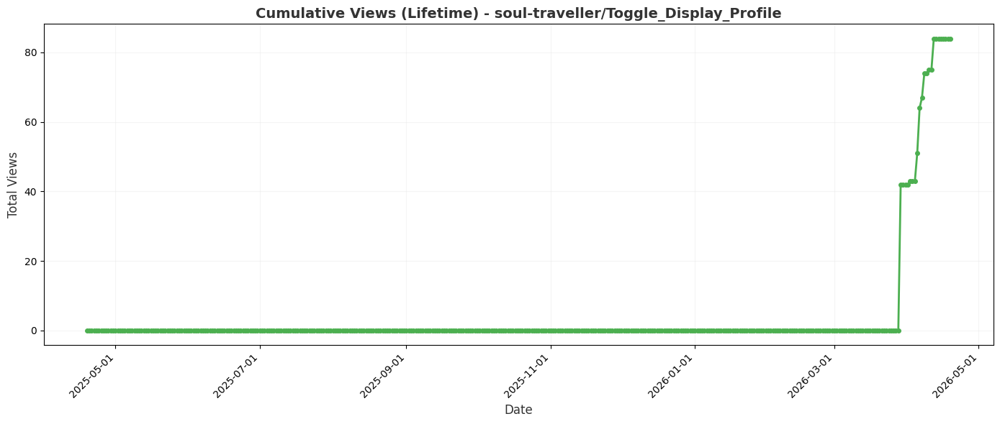

---

# github-traffic-dashboard

### 🗅️ Clones

*Repository clone statistics showing total and unique clones over different time periods.*

| Period | Total | Unique |
|--------|-------|--------|
| Last 30 Days | 669 | 325 |
| Last 90 Days | 669 | 325 |
| Lifetime | 669 | 325 |

### 📄 Repeat vs New Clones

*Analysis of repository adoption showing repeat clones vs new unique clones.*

*Note: GitHub API does not provide geographical location data for cloners.*

| Period | Total Clones | Unique Clones | Repeat Clones | Repeat % |
|--------|--------------|----------------|----------------|----------|
| Last 30 Days | 669 | 325 | 344 | 51.4% |
| Last 90 Days | 669 | 325 | 344 | 51.4% |
| Lifetime | 669 | 325 | 344 | 51.4% |

### 👀 Views

*Repository view statistics showing total and unique views over different time periods.*

| Period | Total | Unique |
|--------|-------|--------|
| Last 30 Days | 260 | 15 |
| Last 90 Days | 260 | 15 |
| Lifetime | 260 | 15 |

### 📞 Referrers

*Top referrer sources driving traffic to this repository.*

**Total Unique Referrers:** 2

| Referrer | Total Views | Unique Visitors |
|----------|-------------|----------------|
| github.com | 45 | 4 |
| soul-traveller.github.io | 4 | 3 |

### 👥 Repeat vs New Visitors

*Analysis of visitor engagement showing repeat visitors vs new unique visitors.*

*Note: GitHub API does not provide geographical location data for visitors.*

| Period | Total Views | Unique Visitors | Repeat Visitors | Repeat % |
|--------|-------------|-----------------|-----------------|----------|
| Last 30 Days | 260 | 15 | 245 | 94.2% |
| Last 90 Days | 260 | 15 | 245 | 94.2% |
| Lifetime | 260 | 15 | 245 | 94.2% |

### 📈 Traffic Graphs

*Visual representations of traffic trends over different time periods.*

#### Daily Traffic (30 Days)

*Shows daily clones and views trends for the last 30 days. Useful for identifying short-term patterns and recent activity spikes.*

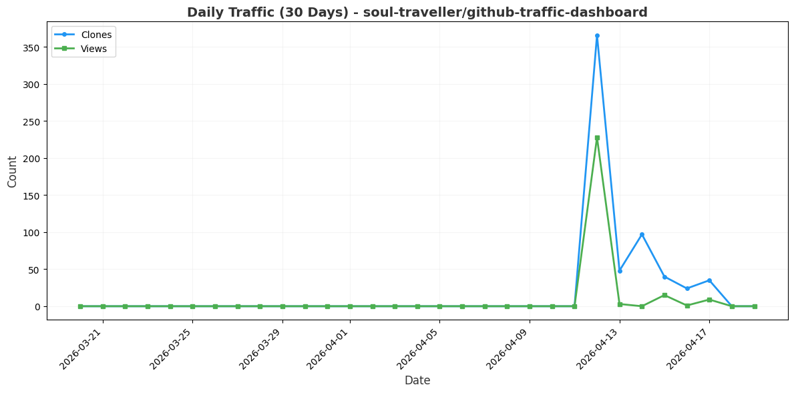

#### Weekly Traffic (12 Weeks)

*Shows weekly aggregated clones and views for the last 12 weeks (~3 months). Useful for identifying medium-term trends and seasonal patterns.*

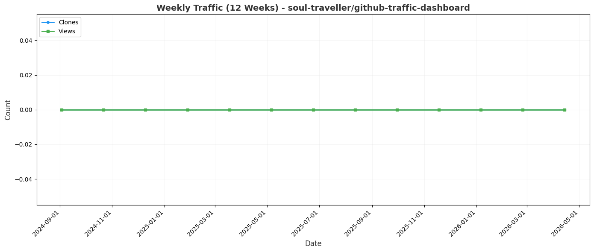

#### Bi-Weekly Traffic (26 Periods)

*Shows bi-weekly aggregated clones and views for the last 26 periods (~1 year). Useful for identifying long-term trends and yearly patterns.*

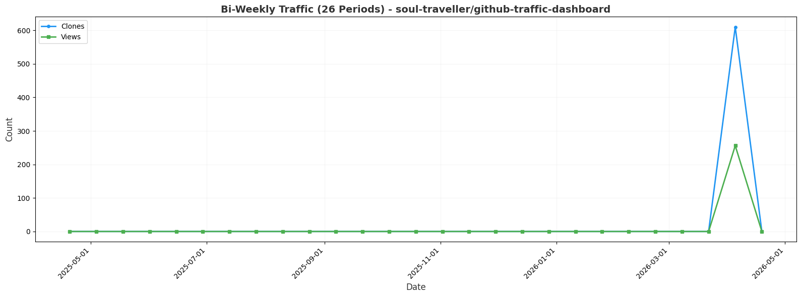

#### Cumulative Traffic (Lifetime)

*Shows running totals of both clones and views over the entire lifetime of tracking. Useful for seeing overall growth and total adoption.*

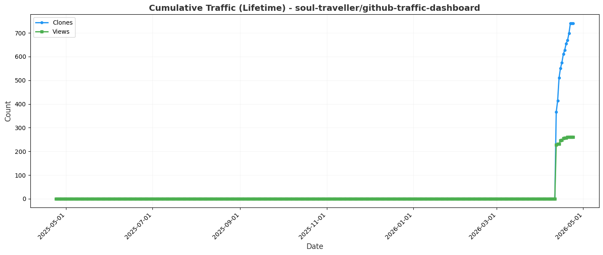

#### Separate Cumulative Graphs

*Individual cumulative graphs for clones and views, allowing for easier comparison between the two metrics.*

**Cumulative Clones:**

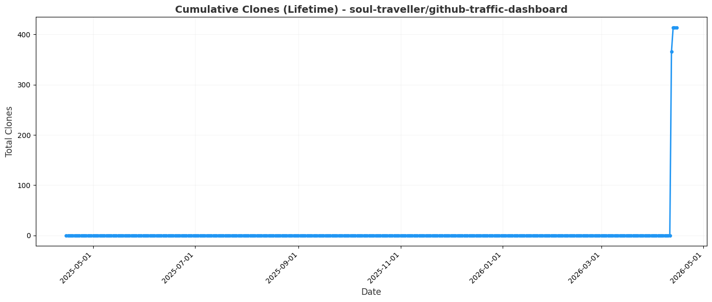

**Cumulative Views:**

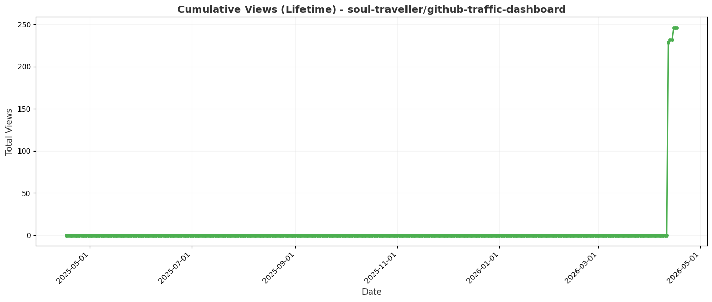

---

# rectarg

### 🗅️ Clones

*Repository clone statistics showing total and unique clones over different time periods.*

| Period | Total | Unique |
|--------|-------|--------|
| Last 30 Days | 61 | 56 |
| Last 90 Days | 61 | 56 |
| Lifetime | 61 | 56 |

### 📄 Repeat vs New Clones

*Analysis of repository adoption showing repeat clones vs new unique clones.*

*Note: GitHub API does not provide geographical location data for cloners.*

| Period | Total Clones | Unique Clones | Repeat Clones | Repeat % |
|--------|--------------|----------------|----------------|----------|
| Last 30 Days | 61 | 56 | 5 | 8.2% |
| Last 90 Days | 61 | 56 | 5 | 8.2% |
| Lifetime | 61 | 56 | 5 | 8.2% |

### 👀 Views

*Repository view statistics showing total and unique views over different time periods.*

| Period | Total | Unique |
|--------|-------|--------|
| Last 30 Days | 5 | 3 |
| Last 90 Days | 5 | 3 |
| Lifetime | 5 | 3 |

### 📞 Referrers

*Top referrer sources driving traffic to this repository.*

**Total Unique Referrers:** 1

| Referrer | Total Views | Unique Visitors |
|----------|-------------|----------------|
| github.com | 1 | 1 |

### 👥 Repeat vs New Visitors

*Analysis of visitor engagement showing repeat visitors vs new unique visitors.*

*Note: GitHub API does not provide geographical location data for visitors.*

| Period | Total Views | Unique Visitors | Repeat Visitors | Repeat % |
|--------|-------------|-----------------|-----------------|----------|
| Last 30 Days | 5 | 3 | 2 | 40.0% |
| Last 90 Days | 5 | 3 | 2 | 40.0% |
| Lifetime | 5 | 3 | 2 | 40.0% |

### 📈 Traffic Graphs

*Visual representations of traffic trends over different time periods.*

#### Daily Traffic (30 Days)

*Shows daily clones and views trends for the last 30 days. Useful for identifying short-term patterns and recent activity spikes.*

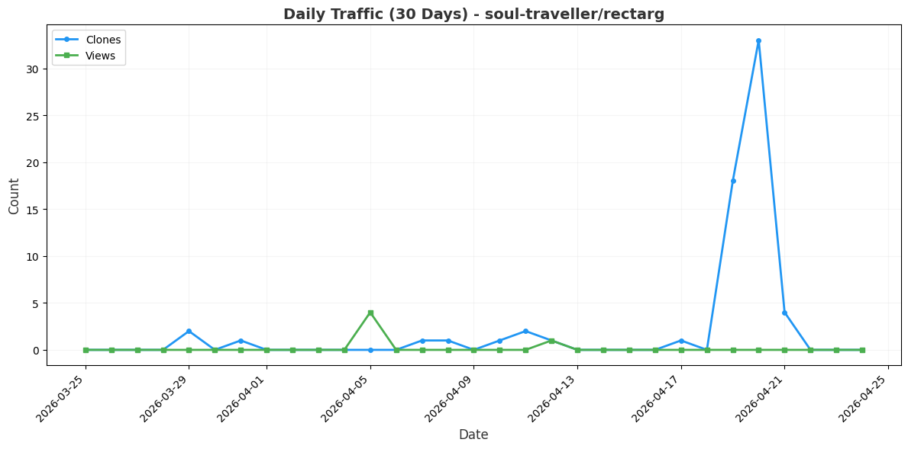

#### Weekly Traffic (12 Weeks)

*Shows weekly aggregated clones and views for the last 12 weeks (~3 months). Useful for identifying medium-term trends and seasonal patterns.*

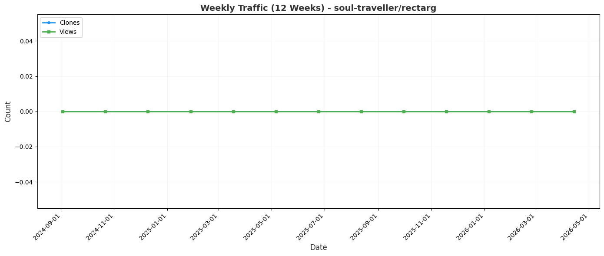

#### Bi-Weekly Traffic (26 Periods)

*Shows bi-weekly aggregated clones and views for the last 26 periods (~1 year). Useful for identifying long-term trends and yearly patterns.*

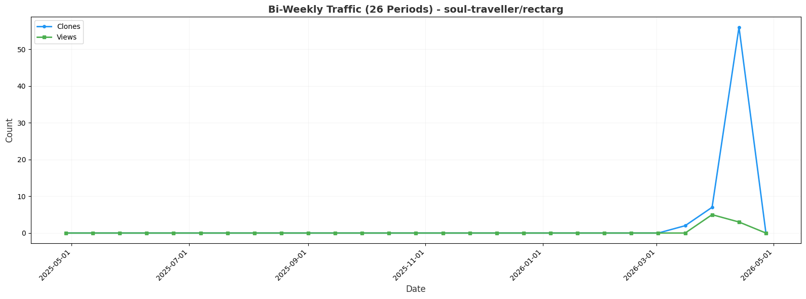

#### Cumulative Traffic (Lifetime)

*Shows running totals of both clones and views over the entire lifetime of tracking. Useful for seeing overall growth and total adoption.*

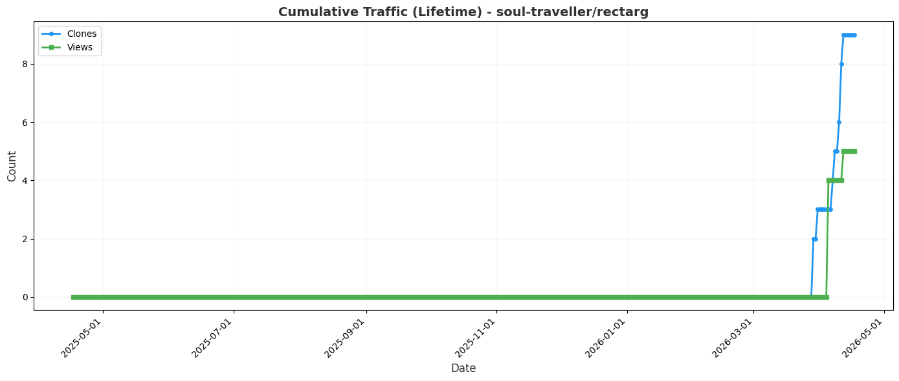

#### Separate Cumulative Graphs

*Individual cumulative graphs for clones and views, allowing for easier comparison between the two metrics.*

**Cumulative Clones:**

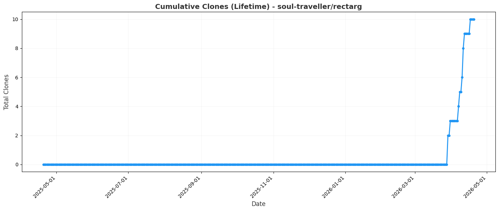

**Cumulative Views:**

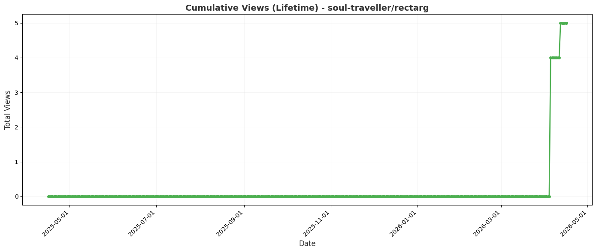

---

# average_ti3s_rgbgeom

### 🗅️ Clones

*Repository clone statistics showing total and unique clones over different time periods.*

| Period | Total | Unique |
|--------|-------|--------|
| Last 30 Days | 10 | 10 |
| Last 90 Days | 10 | 10 |
| Lifetime | 10 | 10 |

### 📄 Repeat vs New Clones

*Analysis of repository adoption showing repeat clones vs new unique clones.*

*Note: GitHub API does not provide geographical location data for cloners.*

| Period | Total Clones | Unique Clones | Repeat Clones | Repeat % |
|--------|--------------|----------------|----------------|----------|
| Last 30 Days | 10 | 10 | 0 | 0.0% |
| Last 90 Days | 10 | 10 | 0 | 0.0% |
| Lifetime | 10 | 10 | 0 | 0.0% |

### 👀 Views

*Repository view statistics showing total and unique views over different time periods.*

| Period | Total | Unique |
|--------|-------|--------|
| Last 30 Days | 0 | 0 |
| Last 90 Days | 0 | 0 |
| Lifetime | 0 | 0 |

### 📞 Referrers

*Top referrer sources driving traffic to this repository.*

**Total Unique Referrers:** 0

*No referrer data available.*

### 👥 Repeat vs New Visitors

*Analysis of visitor engagement showing repeat visitors vs new unique visitors.*

*Note: GitHub API does not provide geographical location data for visitors.*

| Period | Total Views | Unique Visitors | Repeat Visitors | Repeat % |
|--------|-------------|-----------------|-----------------|----------|
| Last 30 Days | 0 | 0 | 0 | 0% |
| Last 90 Days | 0 | 0 | 0 | 0% |
| Lifetime | 0 | 0 | 0 | 0% |

### 📈 Traffic Graphs

*Visual representations of traffic trends over different time periods.*

#### Daily Traffic (30 Days)

*Shows daily clones and views trends for the last 30 days. Useful for identifying short-term patterns and recent activity spikes.*

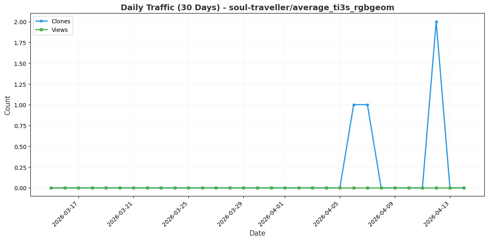

#### Weekly Traffic (12 Weeks)

*Shows weekly aggregated clones and views for the last 12 weeks (~3 months). Useful for identifying medium-term trends and seasonal patterns.*

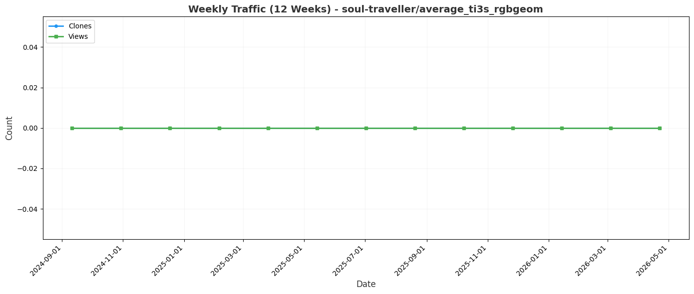

#### Bi-Weekly Traffic (26 Periods)

*Shows bi-weekly aggregated clones and views for the last 26 periods (~1 year). Useful for identifying long-term trends and yearly patterns.*

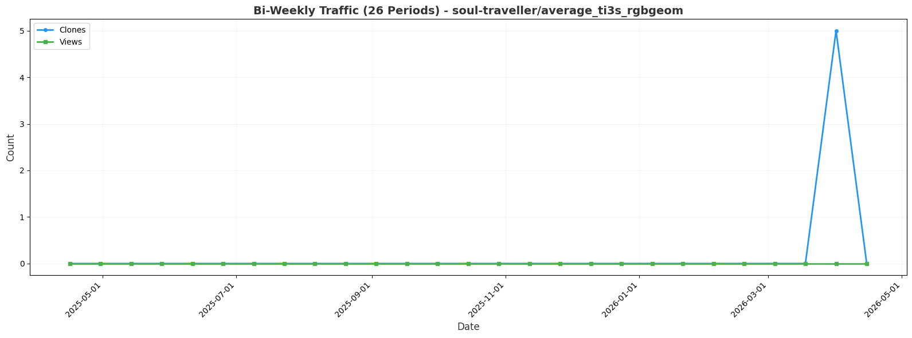

#### Cumulative Traffic (Lifetime)

*Shows running totals of both clones and views over the entire lifetime of tracking. Useful for seeing overall growth and total adoption.*

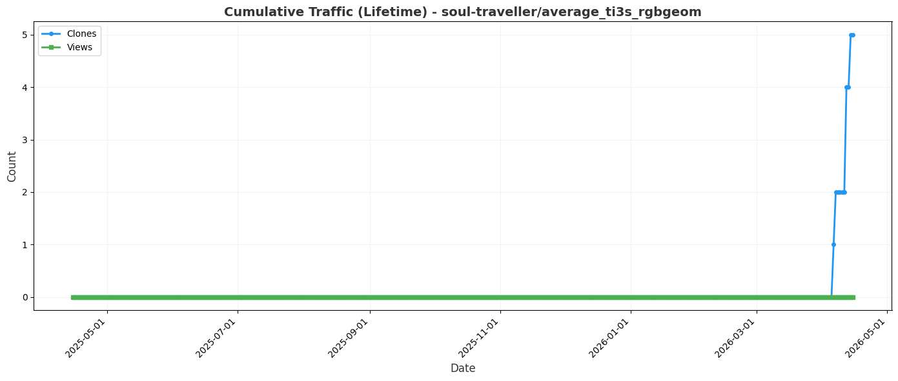

#### Separate Cumulative Graphs

*Individual cumulative graphs for clones and views, allowing for easier comparison between the two metrics.*

**Cumulative Clones:**

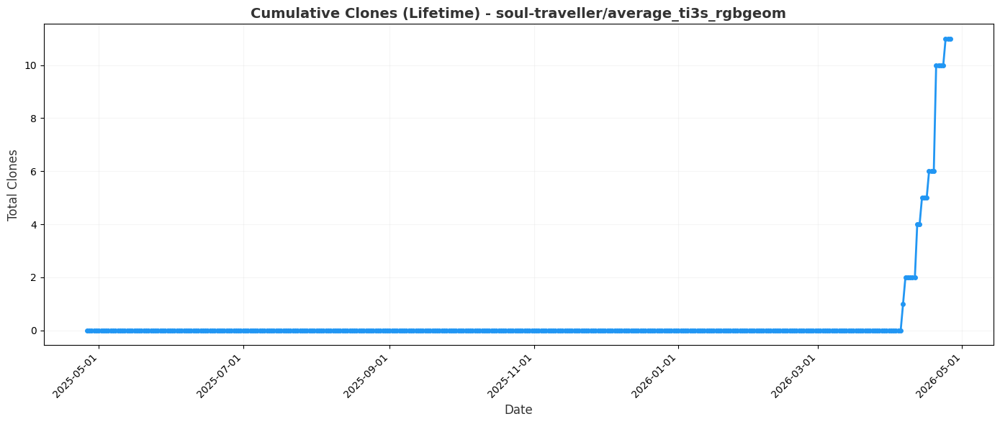

**Cumulative Views:**

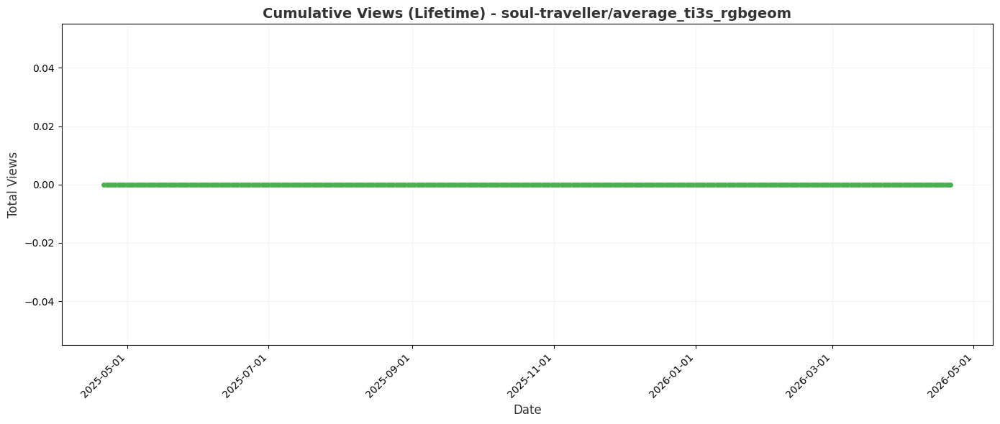

---

# Argyll_Printer_Profiler

### 🗅️ Clones

*Repository clone statistics showing total and unique clones over different time periods.*

| Period | Total | Unique |
|--------|-------|--------|
| Last 30 Days | 86 | 43 |
| Last 90 Days | 86 | 43 |
| Lifetime | 86 | 43 |

### 📄 Repeat vs New Clones

*Analysis of repository adoption showing repeat clones vs new unique clones.*

*Note: GitHub API does not provide geographical location data for cloners.*

| Period | Total Clones | Unique Clones | Repeat Clones | Repeat % |
|--------|--------------|----------------|----------------|----------|
| Last 30 Days | 86 | 43 | 43 | 50.0% |
| Last 90 Days | 86 | 43 | 43 | 50.0% |
| Lifetime | 86 | 43 | 43 | 50.0% |

### 👀 Views

*Repository view statistics showing total and unique views over different time periods.*

| Period | Total | Unique |
|--------|-------|--------|
| Last 30 Days | 84 | 16 |
| Last 90 Days | 84 | 16 |
| Lifetime | 84 | 16 |

### 📞 Referrers

*Top referrer sources driving traffic to this repository.*

**Total Unique Referrers:** 2

| Referrer | Total Views | Unique Visitors |
|----------|-------------|----------------|
| github.com | 26 | 1 |
| soul-traveller.github.io | 8 | 1 |

### 👥 Repeat vs New Visitors

*Analysis of visitor engagement showing repeat visitors vs new unique visitors.*

*Note: GitHub API does not provide geographical location data for visitors.*

| Period | Total Views | Unique Visitors | Repeat Visitors | Repeat % |
|--------|-------------|-----------------|-----------------|----------|
| Last 30 Days | 84 | 16 | 68 | 81.0% |
| Last 90 Days | 84 | 16 | 68 | 81.0% |
| Lifetime | 84 | 16 | 68 | 81.0% |

### 📈 Traffic Graphs

*Visual representations of traffic trends over different time periods.*

#### Daily Traffic (30 Days)

*Shows daily clones and views trends for the last 30 days. Useful for identifying short-term patterns and recent activity spikes.*

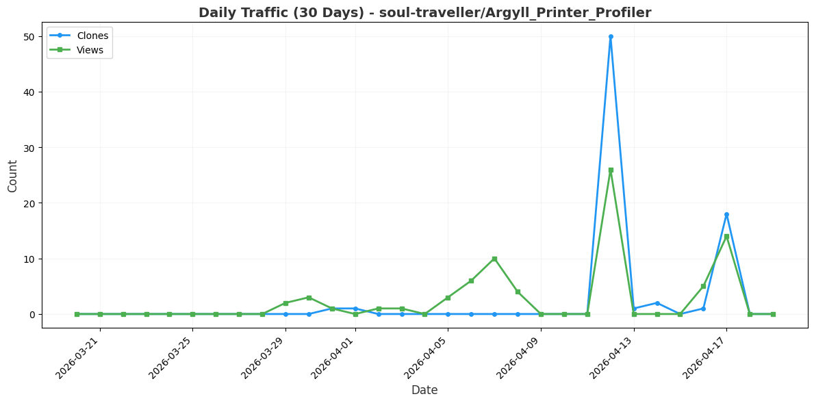

#### Weekly Traffic (12 Weeks)

*Shows weekly aggregated clones and views for the last 12 weeks (~3 months). Useful for identifying medium-term trends and seasonal patterns.*

#### Bi-Weekly Traffic (26 Periods)

*Shows bi-weekly aggregated clones and views for the last 26 periods (~1 year). Useful for identifying long-term trends and yearly patterns.*

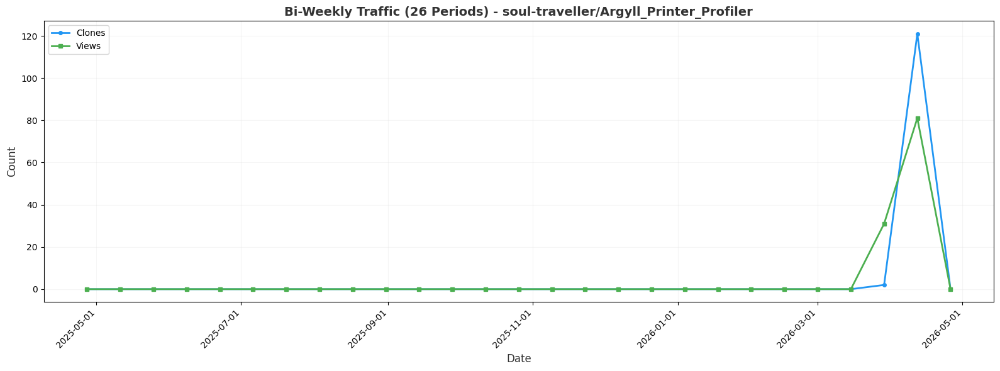

#### Cumulative Traffic (Lifetime)

*Shows running totals of both clones and views over the entire lifetime of tracking. Useful for seeing overall growth and total adoption.*

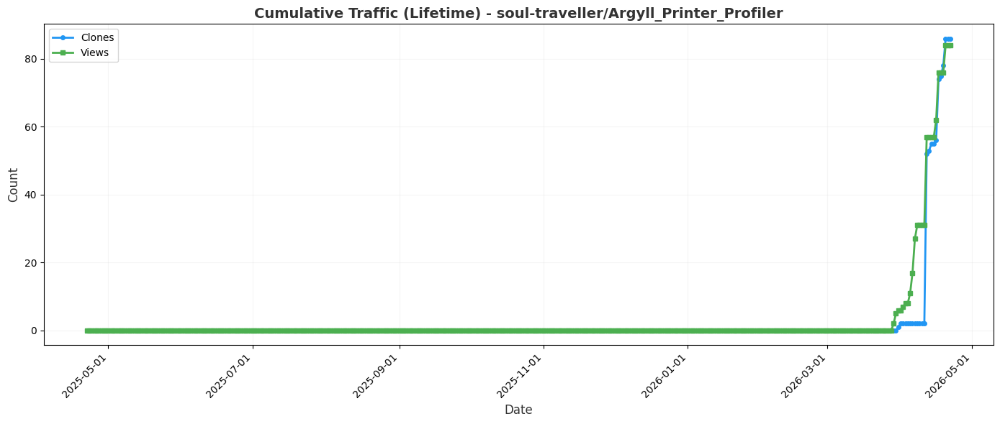

#### Separate Cumulative Graphs

*Individual cumulative graphs for clones and views, allowing for easier comparison between the two metrics.*

**Cumulative Clones:**

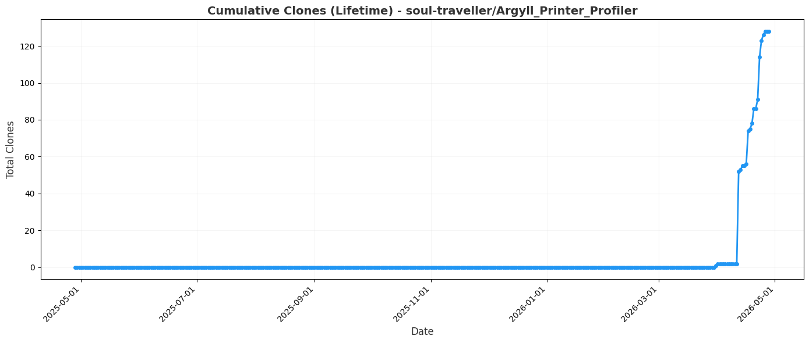

**Cumulative Views:**

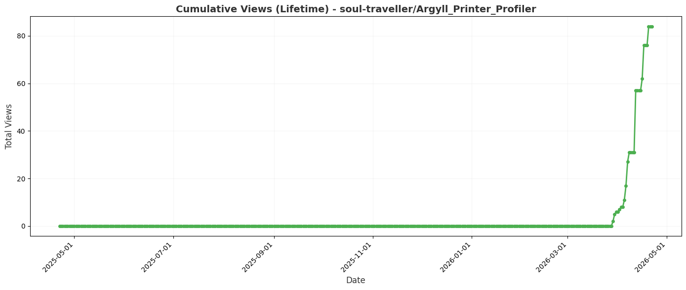

---

# Argyll_Printer_Profiler_GUI

### 🗅️ Clones

*Repository clone statistics showing total and unique clones over different time periods.*

| Period | Total | Unique |
|--------|-------|--------|
| Last 30 Days | 46 | 30 |
| Last 90 Days | 46 | 30 |
| Lifetime | 46 | 30 |

### 📄 Repeat vs New Clones

*Analysis of repository adoption showing repeat clones vs new unique clones.*

*Note: GitHub API does not provide geographical location data for cloners.*

| Period | Total Clones | Unique Clones | Repeat Clones | Repeat % |
|--------|--------------|----------------|----------------|----------|
| Last 30 Days | 46 | 30 | 16 | 34.8% |
| Last 90 Days | 46 | 30 | 16 | 34.8% |
| Lifetime | 46 | 30 | 16 | 34.8% |

### 👀 Views

*Repository view statistics showing total and unique views over different time periods.*

| Period | Total | Unique |
|--------|-------|--------|
| Last 30 Days | 21 | 2 |
| Last 90 Days | 21 | 2 |
| Lifetime | 21 | 2 |

### 📞 Referrers

*Top referrer sources driving traffic to this repository.*

**Total Unique Referrers:** 1

| Referrer | Total Views | Unique Visitors |
|----------|-------------|----------------|
| github.com | 20 | 1 |

### 👥 Repeat vs New Visitors

*Analysis of visitor engagement showing repeat visitors vs new unique visitors.*

*Note: GitHub API does not provide geographical location data for visitors.*

| Period | Total Views | Unique Visitors | Repeat Visitors | Repeat % |
|--------|-------------|-----------------|-----------------|----------|
| Last 30 Days | 21 | 2 | 19 | 90.5% |
| Last 90 Days | 21 | 2 | 19 | 90.5% |
| Lifetime | 21 | 2 | 19 | 90.5% |

### 📈 Traffic Graphs

*Visual representations of traffic trends over different time periods.*

#### Daily Traffic (30 Days)

*Shows daily clones and views trends for the last 30 days. Useful for identifying short-term patterns and recent activity spikes.*

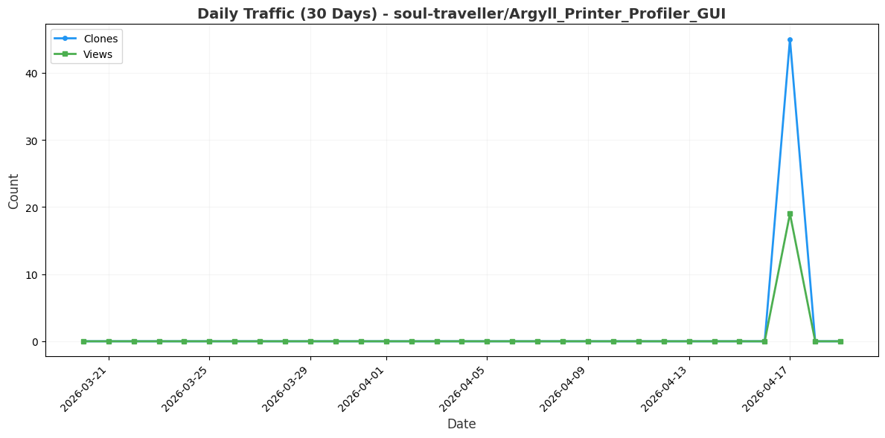

#### Weekly Traffic (12 Weeks)

*Shows weekly aggregated clones and views for the last 12 weeks (~3 months). Useful for identifying medium-term trends and seasonal patterns.*

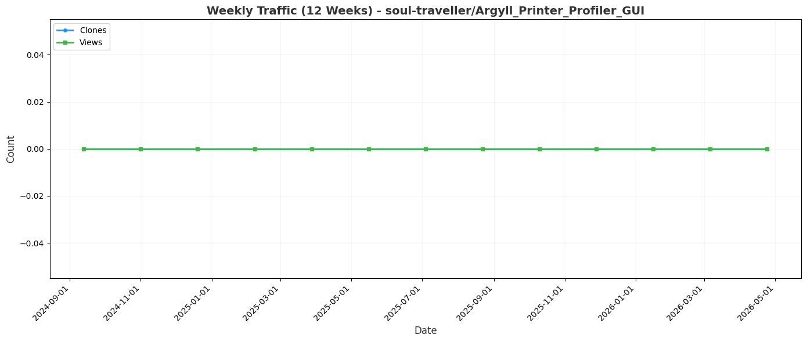

#### Bi-Weekly Traffic (26 Periods)

*Shows bi-weekly aggregated clones and views for the last 26 periods (~1 year). Useful for identifying long-term trends and yearly patterns.*

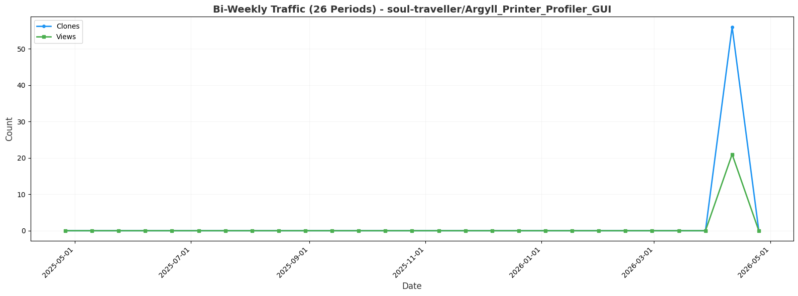

#### Cumulative Traffic (Lifetime)

*Shows running totals of both clones and views over the entire lifetime of tracking. Useful for seeing overall growth and total adoption.*

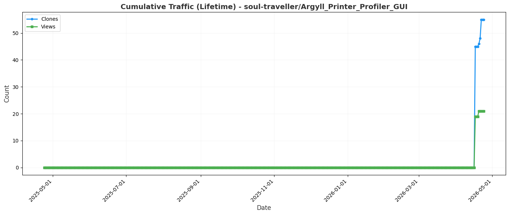

#### Separate Cumulative Graphs

*Individual cumulative graphs for clones and views, allowing for easier comparison between the two metrics.*

**Cumulative Clones:**

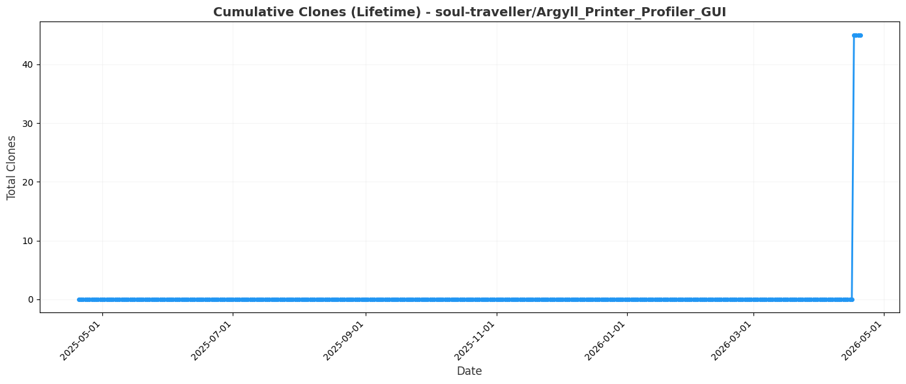

**Cumulative Views:**

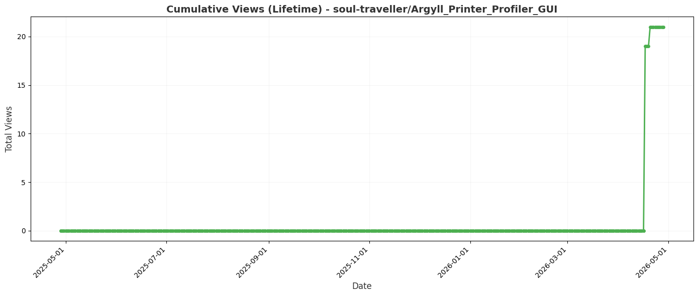

---

*This dashboard is automatically updated daily using GitHub Actions.*
