See full Reference and Usage Guide at:
https://soul-traveller.github.io/github-traffic-dashboard/

# 📊 GitHub Traffic Dashboard

This dashboard tracks historical traffic data (clones and views) for GitHub repositories.

**Last Updated:** 2026-10-09T08:08:52.723314Z

## 📋 How Metrics Are Calculated

This dashboard uses GitHub Traffic API data to calculate the following metrics:

### 📊 Core Metrics

**Views:**
- Counted when someone visits the repository page
- Includes page views from web browsers
- Does not include visits via command-line tools or APIs

**Clones:**
- Counted when someone clones the repository
- Includes clones via `git clone`, GitHub Desktop, download ZIP, and API
- Can occur without a corresponding view event

**Important:** Views and Clones are **independent metrics**. Users can:
- View without cloning
- Clone without viewing (e.g., via `git clone` command)
- Both view and clone

### 🔢 Calculation Formulas

**For any time period (short-term, medium-term, lifetime):**

**Total Metrics:**
- Total Views = Sum of daily views for the period
- Total Clones = Sum of daily clones for the period

**Unique Metrics:**
- Unique Views = Sum of daily unique views for the period
- Unique Clones = Sum of daily unique clones for the period
  - Note: This sums daily unique counts, which may count the same user on multiple days

**Repeat Metrics:**
- Repeat Views = Total Views - Unique Views
- Repeat Clones = Total Clones - Unique Clones
- Repeat Percentage = (Repeat / Total) × 100

**Example:**
```
If a repository has:
- Total Views: 100
- Unique Views: 20
Then:
- Repeat Views = 100 - 20 = 80
- Repeat Percentage = (80 / 100) × 100 = 80%
```

### 📈 Graph Data Aggregation

**Daily Graphs:**
- Shows raw daily data points
- Each point represents one day's activity

**Weekly Graphs:**
- Aggregates daily data into 7-day periods
- Each point represents the sum of 7 consecutive days

**Bi-Weekly Graphs:**
- Aggregates daily data into 14-day periods
- Each point represents the sum of 14 consecutive days

**Cumulative Graphs:**
- Shows running totals over time
- Each point represents the sum of all previous days plus current day

## 📋 Table of Contents

Quick navigation to repository statistics:

- [Argyll_Printer_Profiler](#argyll-printer-profiler)
- [Argyll_Printer_Profiler_GUI](#argyll-printer-profiler-gui)
- [Toggle_Display_Profile](#toggle-display-profile)
- [rectarg](#rectarg)
- [github-traffic-dashboard](#github-traffic-dashboard)
- [average_ti3s_rgbgeom](#average-ti3s-rgbgeom)
- [read_image_patch_colors](#read-image-patch-colors)

# Argyll_Printer_Profiler

### 🗅️ Clones

*Repository clone statistics showing total and unique clones over different time periods.*

| Period | Total | Unique |
|--------|-------|--------|
| Last 30 Days | 10 | 10 |
| Last 90 Days | 21 | 21 |
| Lifetime | 260 | 146 |

### 📄 Repeat vs New Clones

*Analysis of repository adoption showing repeat clones vs new unique clones.*

*Note: GitHub API does not provide geographical location data for cloners.*

| Period | Total Clones | Unique Clones | Repeat Clones | Repeat % |
|--------|--------------|----------------|----------------|----------|
| Last 30 Days | 10 | 10 | 0 | 0.0% |
| Last 90 Days | 21 | 21 | 0 | 0.0% |
| Lifetime | 260 | 146 | 114 | 43.8% |

### 👀 Views

*Repository view statistics showing total and unique views over different time periods.*

| Period | Total | Unique |
|--------|-------|--------|
| Last 30 Days | 67 | 17 |
| Last 90 Days | 95 | 33 |
| Lifetime | 307 | 105 |

### 📞 Referrers

*Top referrer sources driving traffic to this repository.*

**Total Unique Referrers:** 4

| Referrer | Total Views | Unique Visitors |
|----------|-------------|----------------|
| github.com | 7 | 4 |
| soul-traveller.github.io | 5 | 1 |
| Google | 3 | 3 |
| druckerchannel.de | 1 | 1 |

### 👥 Repeat vs New Visitors

*Analysis of visitor engagement showing repeat visitors vs new unique visitors.*

*Note: GitHub API does not provide geographical location data for visitors.*

| Period | Total Views | Unique Visitors | Repeat Visitors | Repeat % |
|--------|-------------|-----------------|-----------------|----------|
| Last 30 Days | 67 | 17 | 50 | 74.6% |
| Last 90 Days | 95 | 33 | 62 | 65.3% |
| Lifetime | 307 | 105 | 202 | 65.8% |

### 📈 Traffic Graphs

*Visual representations of traffic trends over different time periods.*

#### Daily Traffic (30 Days)

*Shows daily clones and views trends for the last 30 days. Useful for identifying short-term patterns and recent activity spikes.*

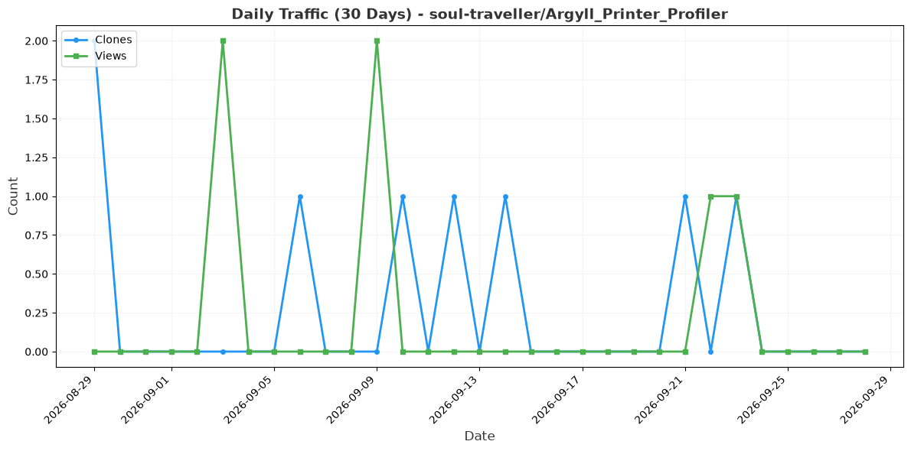

#### Weekly Traffic (12 Weeks)

*Shows weekly aggregated clones and views for the last 12 weeks (~3 months). Useful for identifying medium-term trends and seasonal patterns.*

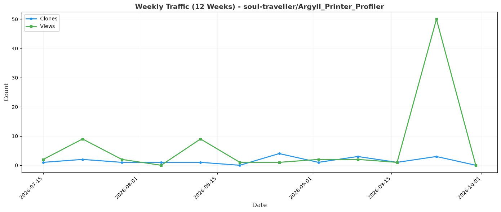

#### Bi-Weekly Traffic (26 Periods)

*Shows bi-weekly aggregated clones and views for the last 26 periods (~1 year). Useful for identifying long-term trends and yearly patterns.*

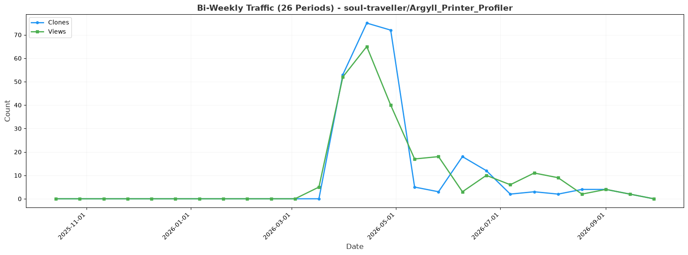

#### Cumulative Traffic (Lifetime)

*Shows running totals of both clones and views over the entire lifetime of tracking. Useful for seeing overall growth and total adoption.*

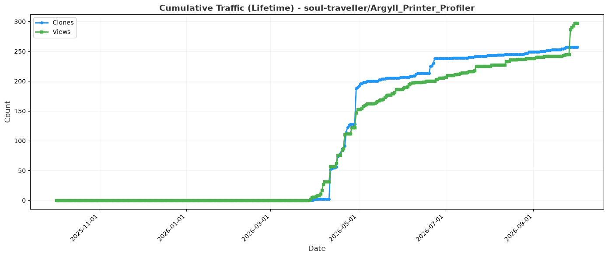

#### Separate Cumulative Graphs

*Individual cumulative graphs for clones and views, allowing for easier comparison between the two metrics.*

**Cumulative Clones:**

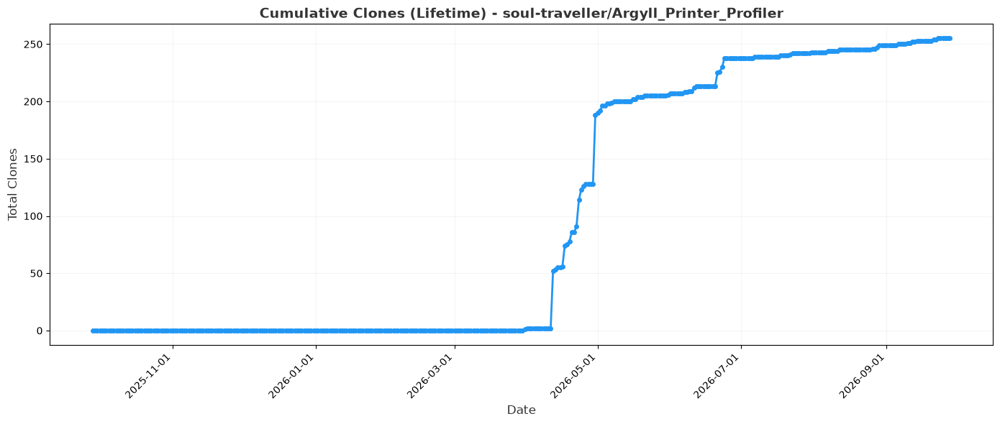

**Cumulative Views:**

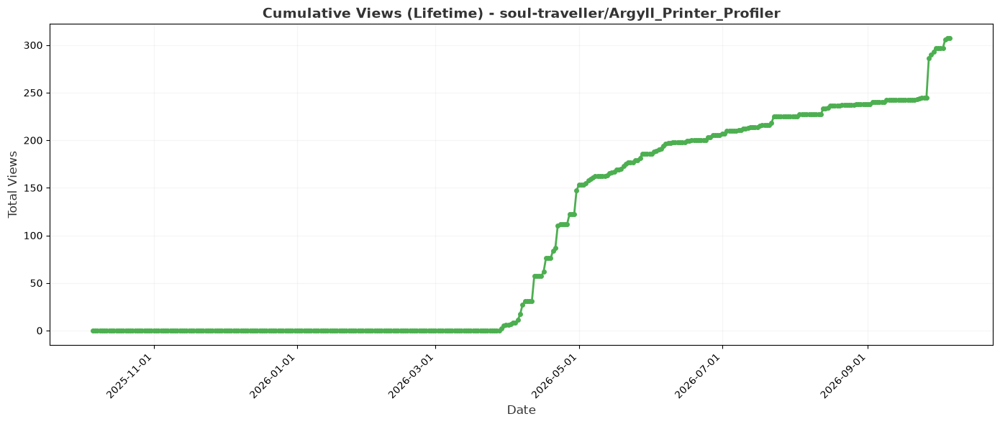

---

# Argyll_Printer_Profiler_GUI

### 🗅️ Clones

*Repository clone statistics showing total and unique clones over different time periods.*

| Period | Total | Unique |
|--------|-------|--------|
| Last 30 Days | 12 | 11 |
| Last 90 Days | 25 | 24 |
| Lifetime | 163 | 105 |

### 📄 Repeat vs New Clones

*Analysis of repository adoption showing repeat clones vs new unique clones.*

*Note: GitHub API does not provide geographical location data for cloners.*

| Period | Total Clones | Unique Clones | Repeat Clones | Repeat % |
|--------|--------------|----------------|----------------|----------|
| Last 30 Days | 12 | 11 | 1 | 8.3% |
| Last 90 Days | 25 | 24 | 1 | 4.0% |
| Lifetime | 163 | 105 | 58 | 35.6% |

### 👀 Views

*Repository view statistics showing total and unique views over different time periods.*

| Period | Total | Unique |
|--------|-------|--------|
| Last 30 Days | 1 | 1 |
| Last 90 Days | 3 | 3 |
| Lifetime | 29 | 8 |

### 📞 Referrers

*Top referrer sources driving traffic to this repository.*

**Total Unique Referrers:** 1

| Referrer | Total Views | Unique Visitors |
|----------|-------------|----------------|
| github.com | 1 | 1 |

### 👥 Repeat vs New Visitors

*Analysis of visitor engagement showing repeat visitors vs new unique visitors.*

*Note: GitHub API does not provide geographical location data for visitors.*

| Period | Total Views | Unique Visitors | Repeat Visitors | Repeat % |
|--------|-------------|-----------------|-----------------|----------|
| Last 30 Days | 1 | 1 | 0 | 0.0% |
| Last 90 Days | 3 | 3 | 0 | 0.0% |
| Lifetime | 29 | 8 | 21 | 72.4% |

### 📈 Traffic Graphs

*Visual representations of traffic trends over different time periods.*

#### Daily Traffic (30 Days)

*Shows daily clones and views trends for the last 30 days. Useful for identifying short-term patterns and recent activity spikes.*

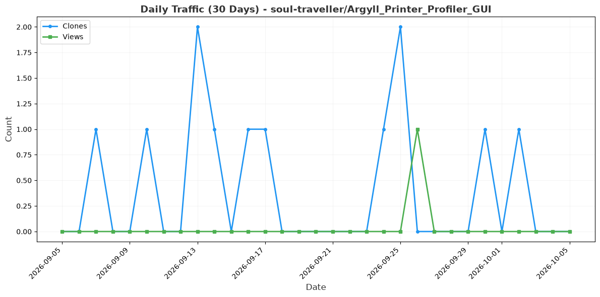

#### Weekly Traffic (12 Weeks)

*Shows weekly aggregated clones and views for the last 12 weeks (~3 months). Useful for identifying medium-term trends and seasonal patterns.*

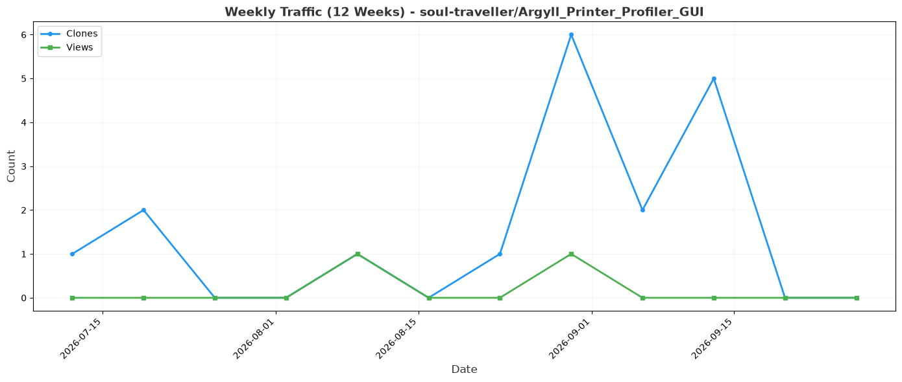

#### Bi-Weekly Traffic (26 Periods)

*Shows bi-weekly aggregated clones and views for the last 26 periods (~1 year). Useful for identifying long-term trends and yearly patterns.*

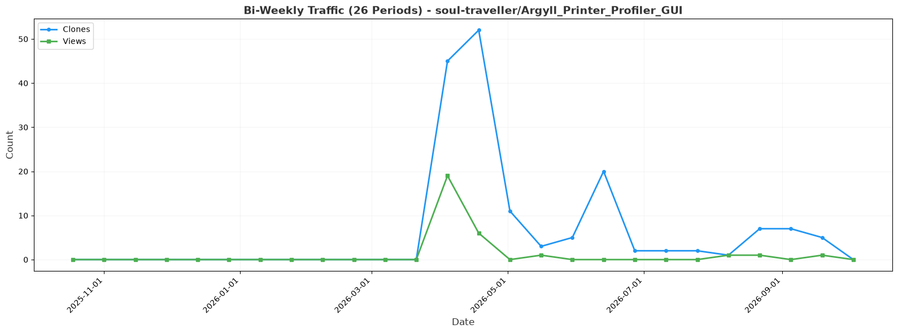

#### Cumulative Traffic (Lifetime)

*Shows running totals of both clones and views over the entire lifetime of tracking. Useful for seeing overall growth and total adoption.*

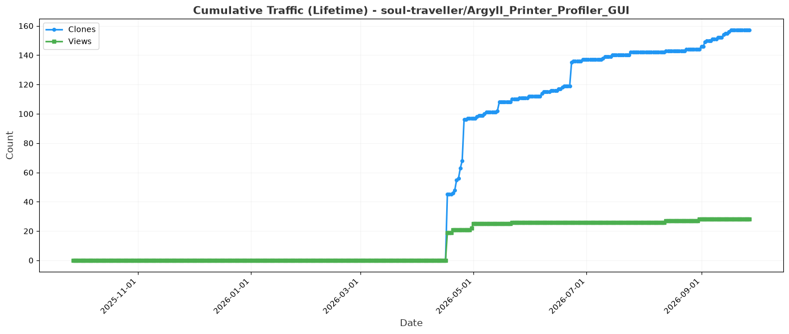

#### Separate Cumulative Graphs

*Individual cumulative graphs for clones and views, allowing for easier comparison between the two metrics.*

**Cumulative Clones:**

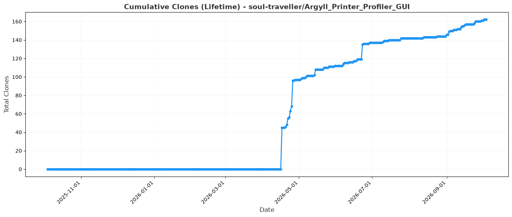

**Cumulative Views:**

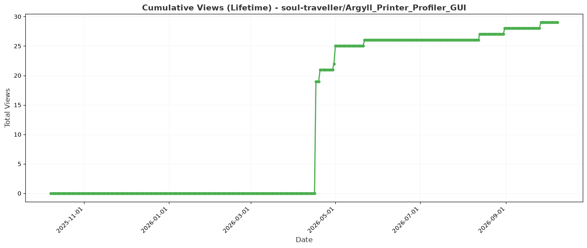

---

# Toggle_Display_Profile

### 🗅️ Clones

*Repository clone statistics showing total and unique clones over different time periods.*

| Period | Total | Unique |
|--------|-------|--------|
| Last 30 Days | 14 | 14 |
| Last 90 Days | 43 | 30 |
| Lifetime | 196 | 131 |

### 📄 Repeat vs New Clones

*Analysis of repository adoption showing repeat clones vs new unique clones.*

*Note: GitHub API does not provide geographical location data for cloners.*

| Period | Total Clones | Unique Clones | Repeat Clones | Repeat % |
|--------|--------------|----------------|----------------|----------|
| Last 30 Days | 14 | 14 | 0 | 0.0% |
| Last 90 Days | 43 | 30 | 13 | 30.2% |
| Lifetime | 196 | 131 | 65 | 33.2% |

### 👀 Views

*Repository view statistics showing total and unique views over different time periods.*

| Period | Total | Unique |
|--------|-------|--------|
| Last 30 Days | 17 | 2 |
| Last 90 Days | 18 | 3 |
| Lifetime | 106 | 13 |

### 📞 Referrers

*Top referrer sources driving traffic to this repository.*

**Total Unique Referrers:** 2

| Referrer | Total Views | Unique Visitors |
|----------|-------------|----------------|
| github.com | 2 | 2 |
| soul-traveller.github.io | 1 | 1 |

### 👥 Repeat vs New Visitors

*Analysis of visitor engagement showing repeat visitors vs new unique visitors.*

*Note: GitHub API does not provide geographical location data for visitors.*

| Period | Total Views | Unique Visitors | Repeat Visitors | Repeat % |
|--------|-------------|-----------------|-----------------|----------|
| Last 30 Days | 17 | 2 | 15 | 88.2% |
| Last 90 Days | 18 | 3 | 15 | 83.3% |
| Lifetime | 106 | 13 | 93 | 87.7% |

### 📈 Traffic Graphs

*Visual representations of traffic trends over different time periods.*

#### Daily Traffic (30 Days)

*Shows daily clones and views trends for the last 30 days. Useful for identifying short-term patterns and recent activity spikes.*

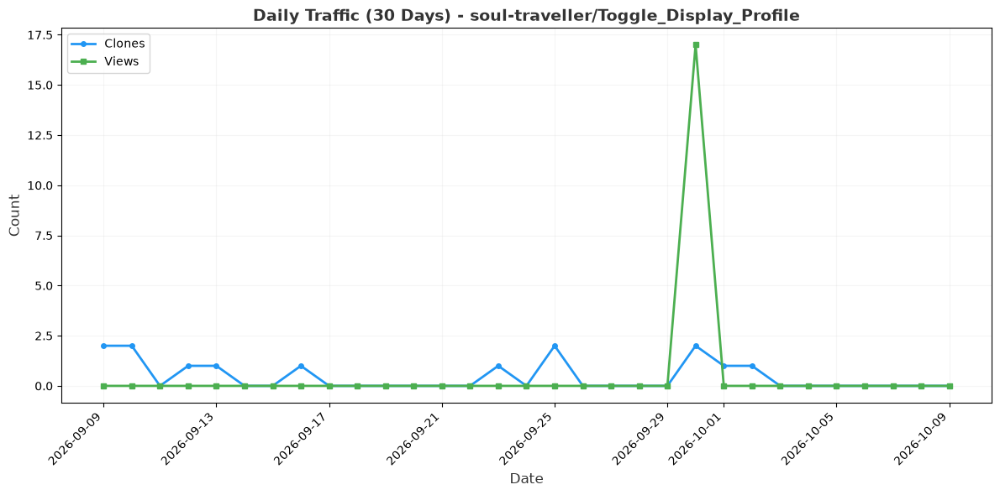

#### Weekly Traffic (12 Weeks)

*Shows weekly aggregated clones and views for the last 12 weeks (~3 months). Useful for identifying medium-term trends and seasonal patterns.*

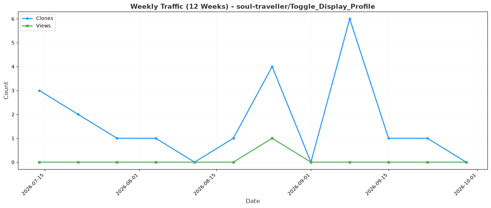

#### Bi-Weekly Traffic (26 Periods)

*Shows bi-weekly aggregated clones and views for the last 26 periods (~1 year). Useful for identifying long-term trends and yearly patterns.*

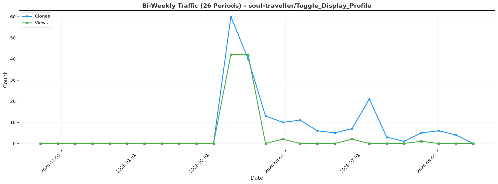

#### Cumulative Traffic (Lifetime)

*Shows running totals of both clones and views over the entire lifetime of tracking. Useful for seeing overall growth and total adoption.*

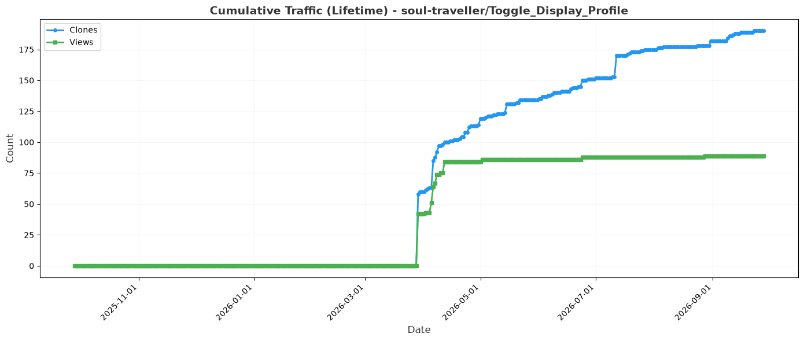

#### Separate Cumulative Graphs

*Individual cumulative graphs for clones and views, allowing for easier comparison between the two metrics.*

**Cumulative Clones:**

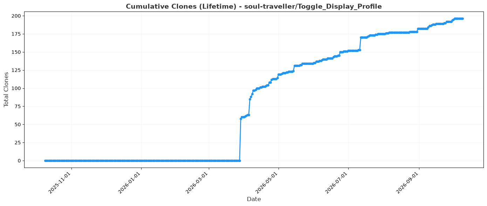

**Cumulative Views:**

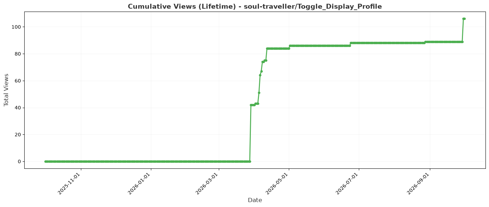

---

# rectarg

### 🗅️ Clones

*Repository clone statistics showing total and unique clones over different time periods.*

| Period | Total | Unique |
|--------|-------|--------|
| Last 30 Days | 16 | 16 |
| Last 90 Days | 32 | 26 |
| Lifetime | 128 | 114 |

### 📄 Repeat vs New Clones

*Analysis of repository adoption showing repeat clones vs new unique clones.*

*Note: GitHub API does not provide geographical location data for cloners.*

| Period | Total Clones | Unique Clones | Repeat Clones | Repeat % |
|--------|--------------|----------------|----------------|----------|
| Last 30 Days | 16 | 16 | 0 | 0.0% |
| Last 90 Days | 32 | 26 | 6 | 18.8% |
| Lifetime | 128 | 114 | 14 | 10.9% |

### 👀 Views

*Repository view statistics showing total and unique views over different time periods.*

| Period | Total | Unique |
|--------|-------|--------|
| Last 30 Days | 5 | 3 |
| Last 90 Days | 40 | 13 |
| Lifetime | 57 | 25 |

### 📞 Referrers

*Top referrer sources driving traffic to this repository.*

**Total Unique Referrers:** 0

*No referrer data available.*

### 👥 Repeat vs New Visitors

*Analysis of visitor engagement showing repeat visitors vs new unique visitors.*

*Note: GitHub API does not provide geographical location data for visitors.*

| Period | Total Views | Unique Visitors | Repeat Visitors | Repeat % |
|--------|-------------|-----------------|-----------------|----------|
| Last 30 Days | 5 | 3 | 2 | 40.0% |
| Last 90 Days | 40 | 13 | 27 | 67.5% |
| Lifetime | 57 | 25 | 32 | 56.1% |

### 📈 Traffic Graphs

*Visual representations of traffic trends over different time periods.*

#### Daily Traffic (30 Days)

*Shows daily clones and views trends for the last 30 days. Useful for identifying short-term patterns and recent activity spikes.*

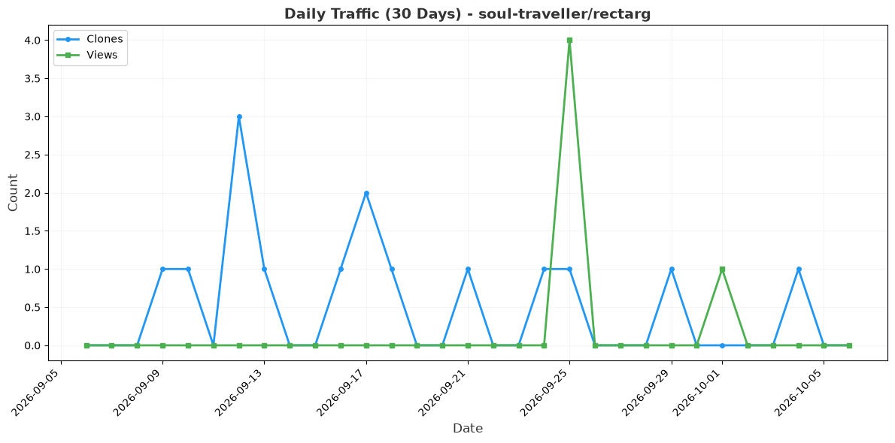

#### Weekly Traffic (12 Weeks)

*Shows weekly aggregated clones and views for the last 12 weeks (~3 months). Useful for identifying medium-term trends and seasonal patterns.*

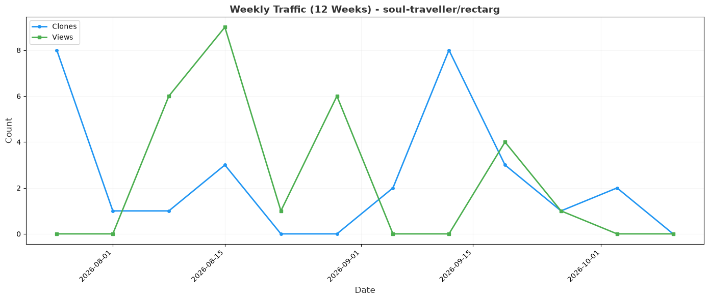

#### Bi-Weekly Traffic (26 Periods)

*Shows bi-weekly aggregated clones and views for the last 26 periods (~1 year). Useful for identifying long-term trends and yearly patterns.*

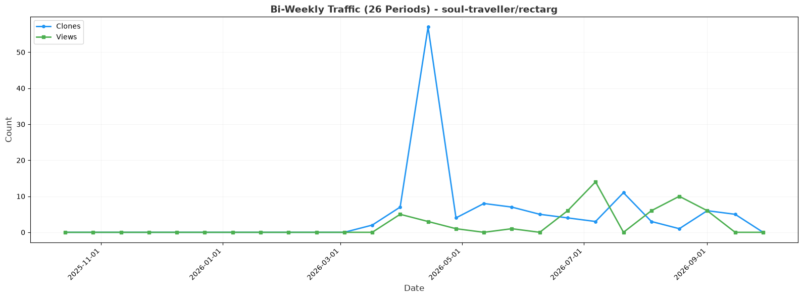

#### Cumulative Traffic (Lifetime)

*Shows running totals of both clones and views over the entire lifetime of tracking. Useful for seeing overall growth and total adoption.*

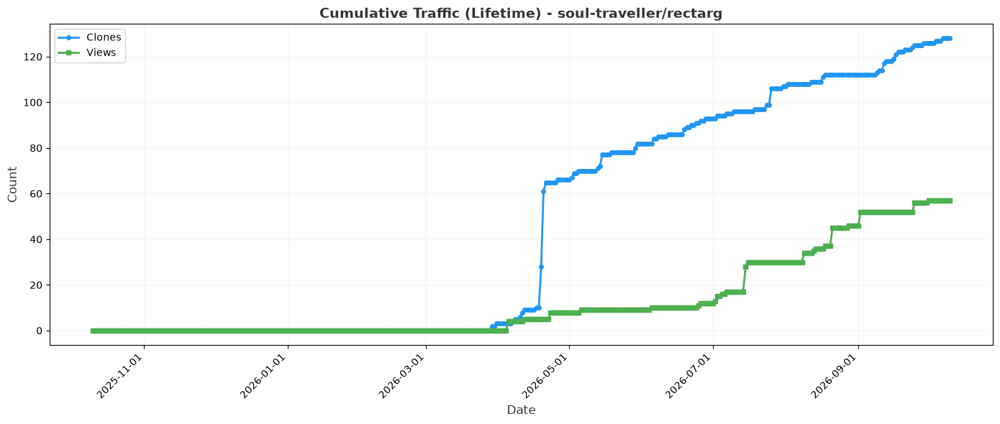

#### Separate Cumulative Graphs

*Individual cumulative graphs for clones and views, allowing for easier comparison between the two metrics.*

**Cumulative Clones:**

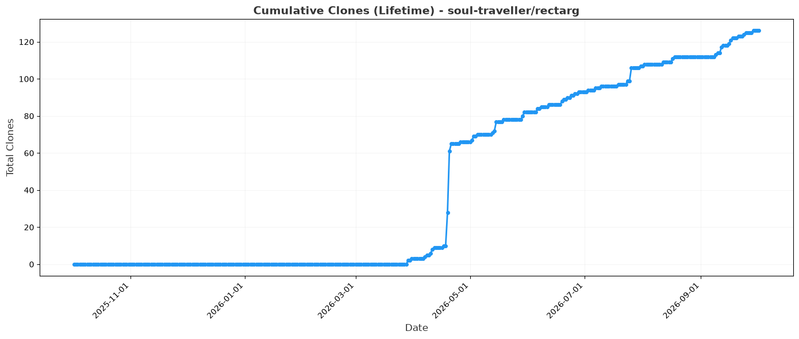

**Cumulative Views:**

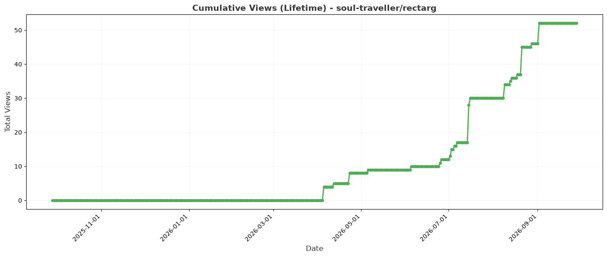

---

# github-traffic-dashboard

### 🗅️ Clones

*Repository clone statistics showing total and unique clones over different time periods.*

| Period | Total | Unique |
|--------|-------|--------|
| Last 30 Days | 242 | 160 |
| Last 90 Days | 724 | 507 |
| Lifetime | 2936 | 1521 |

### 📄 Repeat vs New Clones

*Analysis of repository adoption showing repeat clones vs new unique clones.*

*Note: GitHub API does not provide geographical location data for cloners.*

| Period | Total Clones | Unique Clones | Repeat Clones | Repeat % |
|--------|--------------|----------------|----------------|----------|
| Last 30 Days | 242 | 160 | 82 | 33.9% |
| Last 90 Days | 724 | 507 | 217 | 30.0% |
| Lifetime | 2936 | 1521 | 1415 | 48.2% |

### 👀 Views

*Repository view statistics showing total and unique views over different time periods.*

| Period | Total | Unique |
|--------|-------|--------|
| Last 30 Days | 7 | 7 |
| Last 90 Days | 10 | 10 |
| Lifetime | 300 | 34 |

### 📞 Referrers

*Top referrer sources driving traffic to this repository.*

**Total Unique Referrers:** 2

| Referrer | Total Views | Unique Visitors |
|----------|-------------|----------------|
| DuckDuckGo | 1 | 1 |
| soul-traveller.github.io | 1 | 1 |

### 👥 Repeat vs New Visitors

*Analysis of visitor engagement showing repeat visitors vs new unique visitors.*

*Note: GitHub API does not provide geographical location data for visitors.*

| Period | Total Views | Unique Visitors | Repeat Visitors | Repeat % |
|--------|-------------|-----------------|-----------------|----------|
| Last 30 Days | 7 | 7 | 0 | 0.0% |
| Last 90 Days | 10 | 10 | 0 | 0.0% |
| Lifetime | 300 | 34 | 266 | 88.7% |

### 📈 Traffic Graphs

*Visual representations of traffic trends over different time periods.*

#### Daily Traffic (30 Days)

*Shows daily clones and views trends for the last 30 days. Useful for identifying short-term patterns and recent activity spikes.*

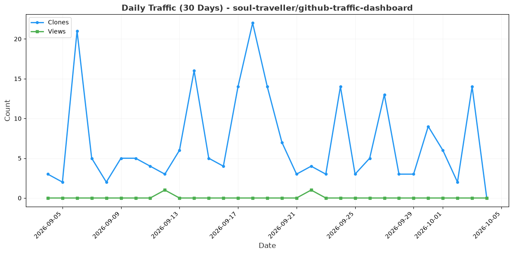

#### Weekly Traffic (12 Weeks)

*Shows weekly aggregated clones and views for the last 12 weeks (~3 months). Useful for identifying medium-term trends and seasonal patterns.*

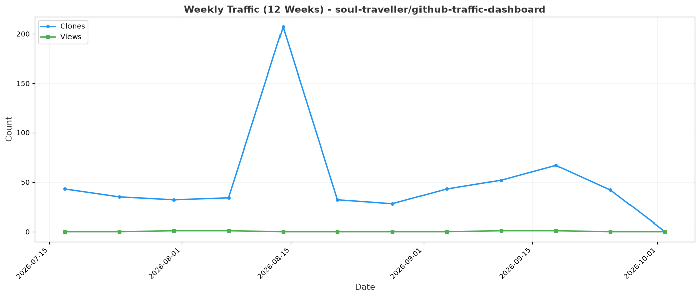

#### Bi-Weekly Traffic (26 Periods)

*Shows bi-weekly aggregated clones and views for the last 26 periods (~1 year). Useful for identifying long-term trends and yearly patterns.*

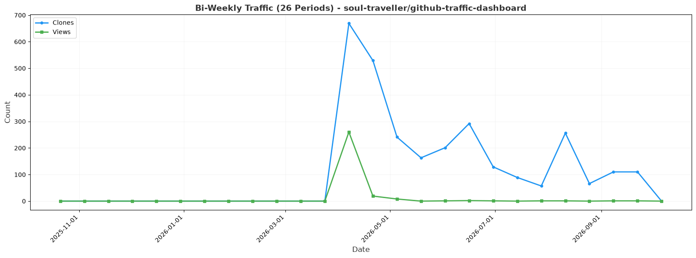

#### Cumulative Traffic (Lifetime)

*Shows running totals of both clones and views over the entire lifetime of tracking. Useful for seeing overall growth and total adoption.*

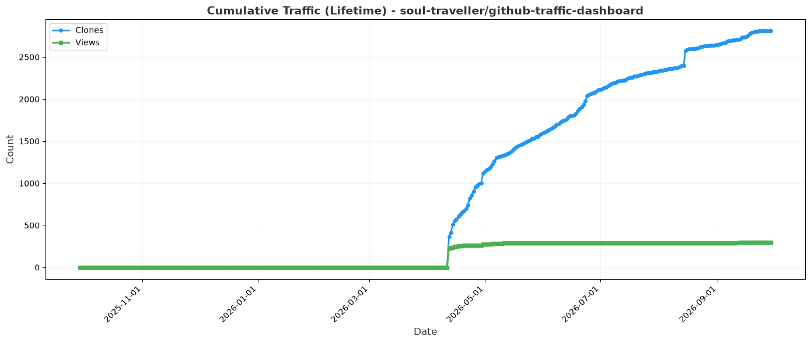

#### Separate Cumulative Graphs

*Individual cumulative graphs for clones and views, allowing for easier comparison between the two metrics.*

**Cumulative Clones:**

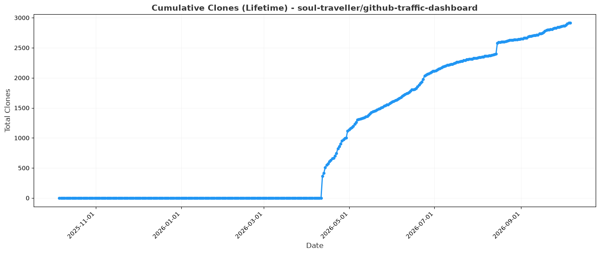

**Cumulative Views:**

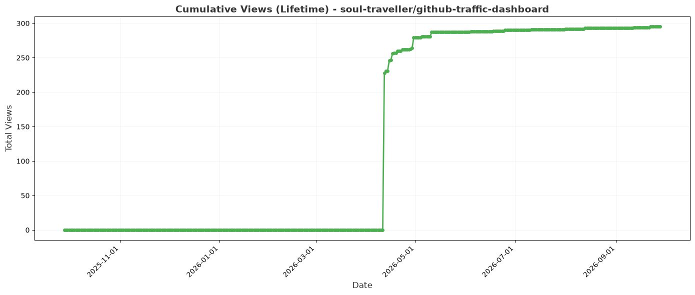

---

# average_ti3s_rgbgeom

### 🗅️ Clones

*Repository clone statistics showing total and unique clones over different time periods.*

| Period | Total | Unique |
|--------|-------|--------|
| Last 30 Days | 9 | 9 |
| Last 90 Days | 15 | 15 |
| Lifetime | 51 | 50 |

### 📄 Repeat vs New Clones

*Analysis of repository adoption showing repeat clones vs new unique clones.*

*Note: GitHub API does not provide geographical location data for cloners.*

| Period | Total Clones | Unique Clones | Repeat Clones | Repeat % |
|--------|--------------|----------------|----------------|----------|
| Last 30 Days | 9 | 9 | 0 | 0.0% |
| Last 90 Days | 15 | 15 | 0 | 0.0% |
| Lifetime | 51 | 50 | 1 | 2.0% |

### 👀 Views

*Repository view statistics showing total and unique views over different time periods.*

| Period | Total | Unique |
|--------|-------|--------|
| Last 30 Days | 0 | 0 |
| Last 90 Days | 1 | 1 |
| Lifetime | 3 | 2 |

### 📞 Referrers

*Top referrer sources driving traffic to this repository.*

**Total Unique Referrers:** 0

*No referrer data available.*

### 👥 Repeat vs New Visitors

*Analysis of visitor engagement showing repeat visitors vs new unique visitors.*

*Note: GitHub API does not provide geographical location data for visitors.*

| Period | Total Views | Unique Visitors | Repeat Visitors | Repeat % |
|--------|-------------|-----------------|-----------------|----------|
| Last 30 Days | 0 | 0 | 0 | 0% |
| Last 90 Days | 1 | 1 | 0 | 0.0% |
| Lifetime | 3 | 2 | 1 | 33.3% |

### 📈 Traffic Graphs

*Visual representations of traffic trends over different time periods.*

#### Daily Traffic (30 Days)

*Shows daily clones and views trends for the last 30 days. Useful for identifying short-term patterns and recent activity spikes.*

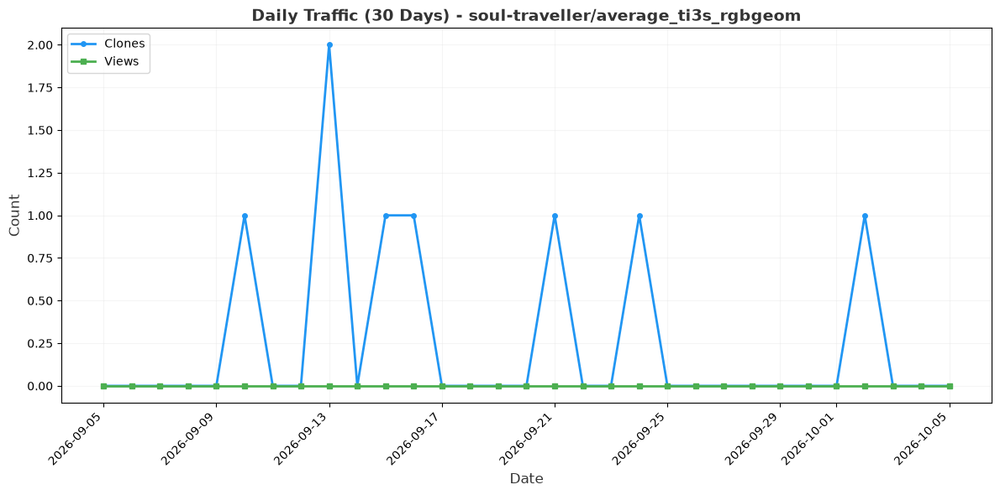

#### Weekly Traffic (12 Weeks)

*Shows weekly aggregated clones and views for the last 12 weeks (~3 months). Useful for identifying medium-term trends and seasonal patterns.*

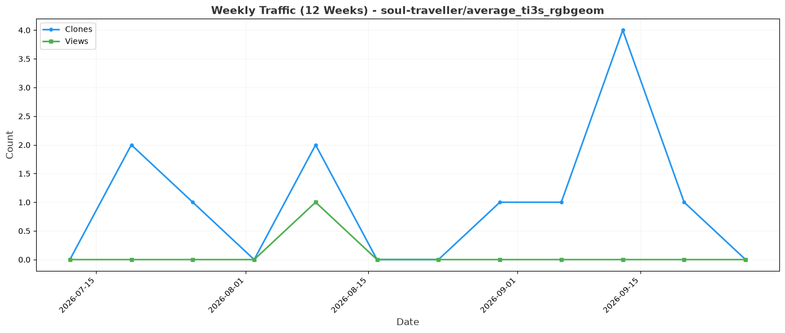

#### Bi-Weekly Traffic (26 Periods)

*Shows bi-weekly aggregated clones and views for the last 26 periods (~1 year). Useful for identifying long-term trends and yearly patterns.*

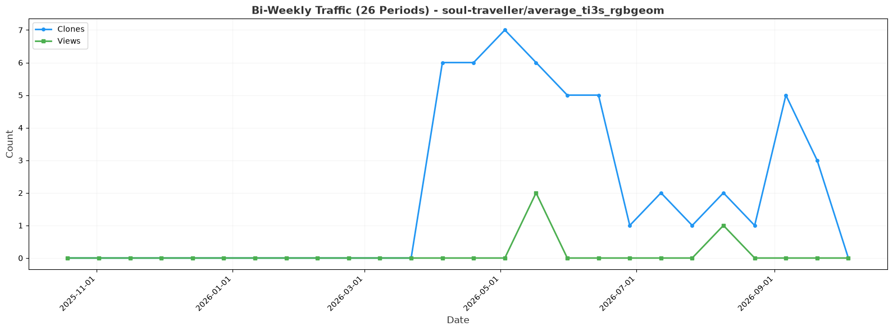

#### Cumulative Traffic (Lifetime)

*Shows running totals of both clones and views over the entire lifetime of tracking. Useful for seeing overall growth and total adoption.*

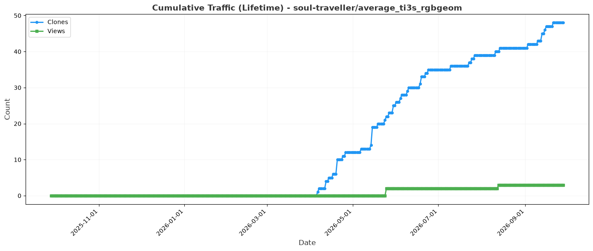

#### Separate Cumulative Graphs

*Individual cumulative graphs for clones and views, allowing for easier comparison between the two metrics.*

**Cumulative Clones:**

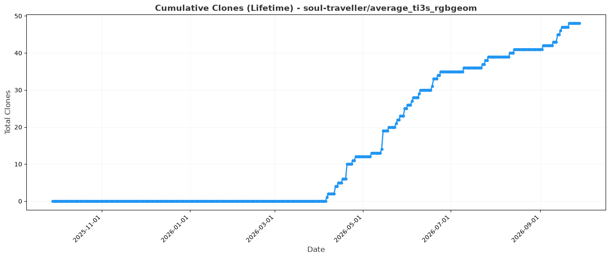

**Cumulative Views:**

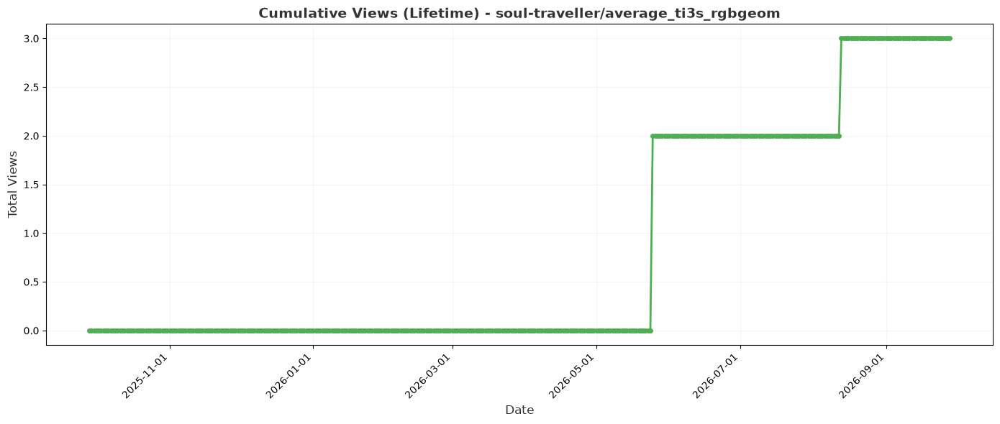

---

# read_image_patch_colors

### 🗅️ Clones

*Repository clone statistics showing total and unique clones over different time periods.*

| Period | Total | Unique |
|--------|-------|--------|
| Last 30 Days | 13 | 13 |
| Last 90 Days | 20 | 20 |
| Lifetime | 82 | 81 |

### 📄 Repeat vs New Clones

*Analysis of repository adoption showing repeat clones vs new unique clones.*

*Note: GitHub API does not provide geographical location data for cloners.*

| Period | Total Clones | Unique Clones | Repeat Clones | Repeat % |
|--------|--------------|----------------|----------------|----------|
| Last 30 Days | 13 | 13 | 0 | 0.0% |
| Last 90 Days | 20 | 20 | 0 | 0.0% |
| Lifetime | 82 | 81 | 1 | 1.2% |

### 👀 Views

*Repository view statistics showing total and unique views over different time periods.*

| Period | Total | Unique |
|--------|-------|--------|
| Last 30 Days | 0 | 0 |
| Last 90 Days | 0 | 0 |
| Lifetime | 5 | 4 |

### 📞 Referrers

*Top referrer sources driving traffic to this repository.*

**Total Unique Referrers:** 0

*No referrer data available.*

### 👥 Repeat vs New Visitors

*Analysis of visitor engagement showing repeat visitors vs new unique visitors.*

*Note: GitHub API does not provide geographical location data for visitors.*

| Period | Total Views | Unique Visitors | Repeat Visitors | Repeat % |
|--------|-------------|-----------------|-----------------|----------|
| Last 30 Days | 0 | 0 | 0 | 0% |
| Last 90 Days | 0 | 0 | 0 | 0% |
| Lifetime | 5 | 4 | 1 | 20.0% |

### 📈 Traffic Graphs

*Visual representations of traffic trends over different time periods.*

#### Daily Traffic (30 Days)

*Shows daily clones and views trends for the last 30 days. Useful for identifying short-term patterns and recent activity spikes.*

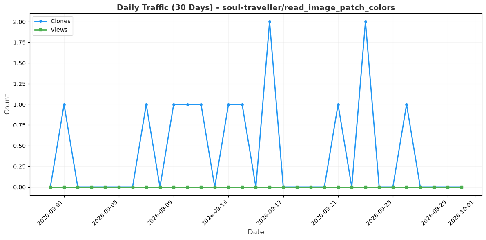

#### Weekly Traffic (12 Weeks)

*Shows weekly aggregated clones and views for the last 12 weeks (~3 months). Useful for identifying medium-term trends and seasonal patterns.*

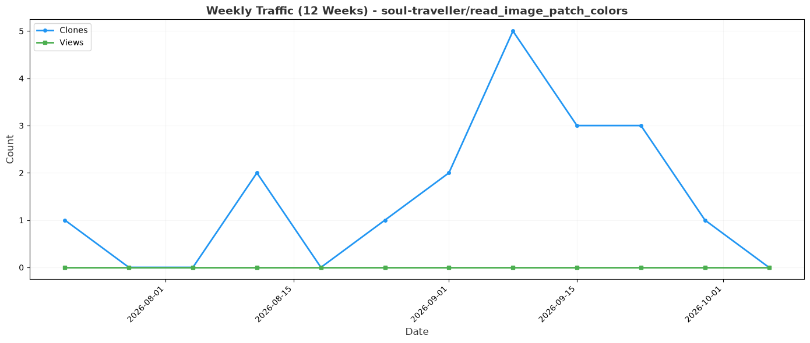

#### Bi-Weekly Traffic (26 Periods)

*Shows bi-weekly aggregated clones and views for the last 26 periods (~1 year). Useful for identifying long-term trends and yearly patterns.*

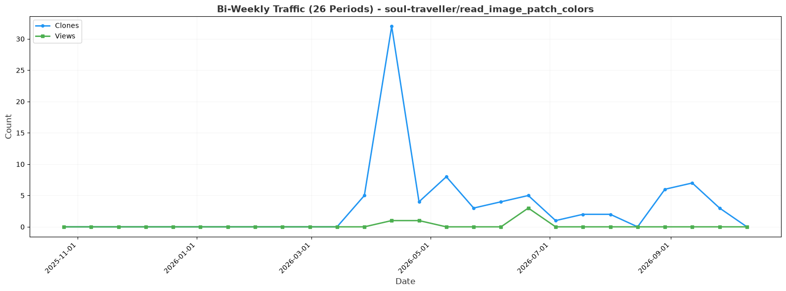

#### Cumulative Traffic (Lifetime)

*Shows running totals of both clones and views over the entire lifetime of tracking. Useful for seeing overall growth and total adoption.*

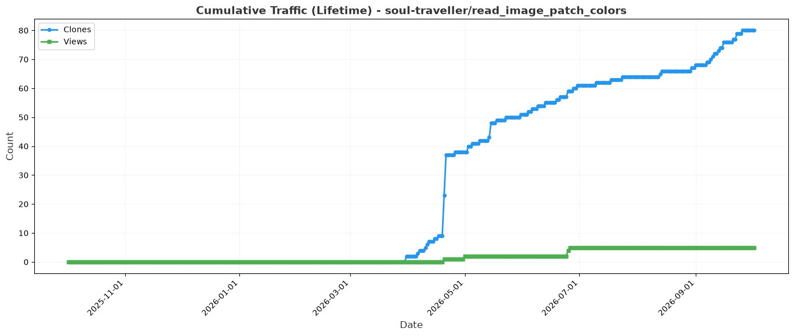

#### Separate Cumulative Graphs

*Individual cumulative graphs for clones and views, allowing for easier comparison between the two metrics.*

**Cumulative Clones:**

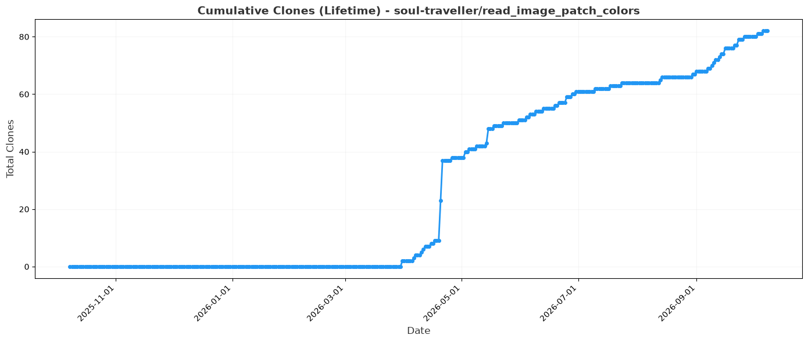

**Cumulative Views:**

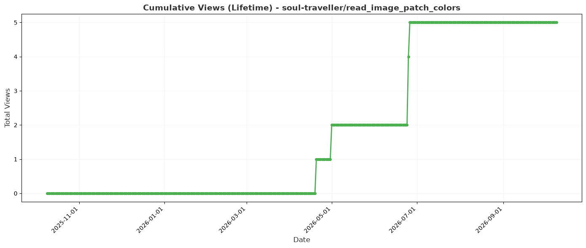

---

*This dashboard is automatically updated daily using GitHub Actions.*
